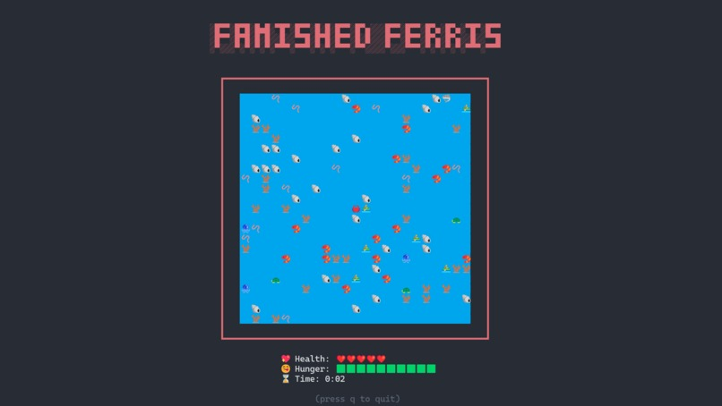

# Famished Ferris

Famished Ferris is a simple terminal-based game starring Ferris, the mascot of the Rust programming language. The game is loosely inspired by Pacman, and is written completely in Rust.

**⚠️ This game may not function correctly in certain terminals. If you experience issues, please try changing your environment or font.**

To play Famished Ferris, clone the repo and run the project with Cargo:

```bash
git clone https://github.com/Podskio/famished-ferris
cd famished-ferris
cargo run --release
```


